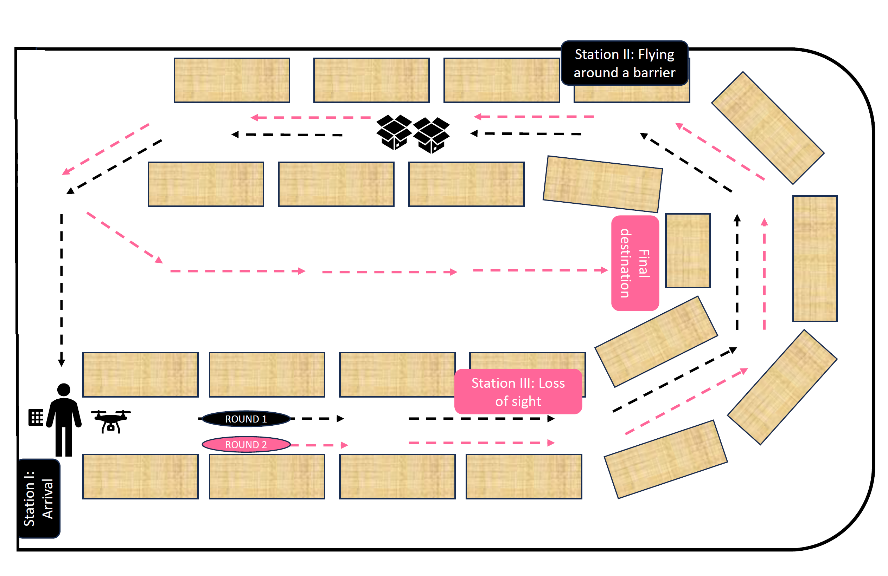

# Human-UAV Collaboration in Warehousing [[IFAC MIM 2025](https://www.sciencedirect.com/science/article/pii/S2405896325011838?via%3Dihub)]

Unmanned Aerial Vehicles (UAVs) are valuable in logistics, especially for hard-to-reach areas. While much research focuses on UAV technology, their interaction with humans remains less explored. 
This study focuses on the technical feasibility of human-UAV interaction in a warehouse setting by designing a robust architecture. UAVs autonomously lead individuals to work stations, 
interacting via a keypad and sensor-based distance estimation. Interaction is recorded using RGB and motion-capture cameras. Results show that safe human-UAV interaction is feasible when UAVs 
maintain full situational awareness. A dataset of these interactions is publicly available at [[Zenodo](https://zenodo.org/records/14181589)]

# Scenario

    

https://github.com/user-attachments/assets/e48849dd-36d8-4ca3-8b1c-9a57b91b7625

